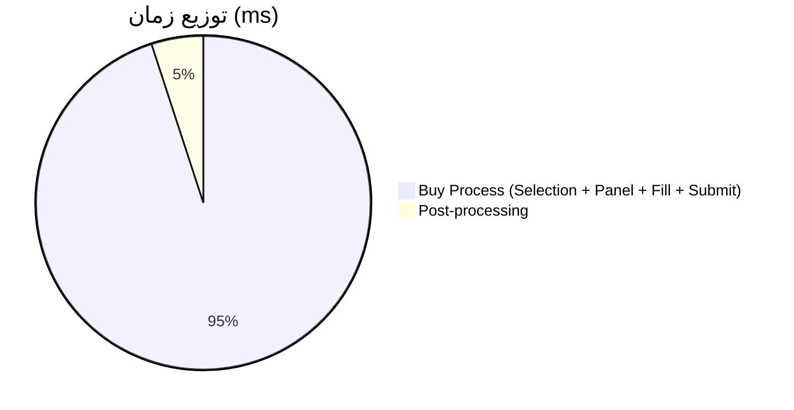

# گزارش تحلیل معامله - buy-1767788216265

**تاریخ:** ۱۴۰۴/۱۰/۱۷, ۱۵:۴۶:۵۶
**Order ID:** buy-1767788216265

## 📋 خلاصه اجرایی

| فیلد | مقدار |
|------|-------|
| Order ID | buy-1767788216265 |
| Model | 4 |
| نماد | زر |
| نوع | فروش |
| قیمت | 682300 |
| تعداد | 2 |
| زمان کل | 2577ms |
| وضعیت | ✅ موفق |

### مقایسه با Benchmarks

| Model | Benchmark | زمان فعلی | تفاوت |
|-------|-----------|-----------|-------|
| Model 4 | 200ms | 2577ms | +2377ms |
| Model 5 | 364ms | 2577ms | +2213ms |
| Model 6 | 50ms | 2577ms | +2527ms |

### 🔍 یافته‌های کلیدی

- زمان اجرا (2577ms) بسیار بیشتر از benchmark Model 4 (200ms) است
- 1 bottleneck اصلی شناسایی شد: Buy Process (Selection + Panel + Fill + Submit)

## ⏱️ Breakdown Timing

| Phase | زمان (ms) | درصد |
|-------|-----------|------|
| Browser Launch + Page Navigation (Pre-transaction) | 0 | 0.0% |
| Balance Reading (Before) | 0 | 0.0% |
| Buy Process (Selection + Panel + Fill + Submit) | 2577 | 100.0% |
| Balance Reading (After) | 2 | 0.1% |
| Post-processing | 136 | 5.3% |
| **Unaccounted Time** | -138 | -5.4% |
| **Total** | 2577 | 100% |

### نمودار توزیع زمان

### Timeline

```mermaid
gantt
  title Timeline معامله
  dateFormat X
  axisFormat %L ms
  Browser_Launch_+_Page_Navigation_(Pre-transaction) : -22054, 0
  Balance_Reading_(Before) : -2605, 0
  Buy_Process_(Selection_+_Panel_+_Fill_+_Submit) : -2579, 2577
  Balance_Reading_(After) : 2011, 2
  Post-processing : 2013, 136
```

## ⚠️ Bottlenecks شناسایی شده

### 1. Buy Process (Selection + Panel + Fill + Submit)

- **شدت:** 🔴 بالا
- **زمان:** 2577ms (100.0%)
- **توصیه:** Migration به Model 5 یا 6
- **بهبود مورد انتظار:** کاهش 95%+ با migration به API

## 💡 پیشنهادات بهینه‌سازی

### 1. Migration به Model 5 (API Direct)

- **اولویت:** 🔴 بالا
- **نوع:** Migration Model
- **توضیحات:** Buy Process با Model 4 کند است. استفاده از Model 5 (API) می‌تواند زمان را به 50-100ms کاهش دهد.
- **بهبود مورد انتظار:** 2448ms (95%)
- **پیاده‌سازی:** استفاده از Model 5 در dashboard: `model: "5"`
- **تأثیر:** صرفه‌جویی 2448ms (95%)

### 2. Migration به Model 6 (Ultra Fast)

- **اولویت:** 🟡 متوسط
- **نوع:** Migration Model
- **توضیحات:** Model 6 برای سرعت حداکثری طراحی شده است (target: <50ms)
- **بهبود مورد انتظار:** 2527ms (98%)
- **پیاده‌سازی:** استفاده از Model 6 در dashboard: `model: "6"`
- **تأثیر:** صرفه‌جویی 2527ms (98%)

## 🔄 مقایسه با Model 5/6

### Model 5 (API Direct)

| فیلد | مقدار |
|------|-------|
| زمان تخمینی | 50ms |
| بهبود | 2527ms (98%) |
| پیچیدگی Migration | 🟢 پایین |

**مزایا:**
- ✅ API-based (بدون UI automation)
- ✅ سرعت بالا (50-100ms پس از بهینه‌سازی)
- ✅ قابلیت skip verification
- ✅ Token caching برای سرعت بیشتر

**معایب:**
- ❌ نیاز به token extraction
- ❌ وابستگی به API stability

### Model 6 (Ultra Fast)

| فیلد | مقدار |
|------|-------|
| زمان تخمینی | 50ms |
| بهبود | 2527ms (98%) |
| پیچیدگی Migration | 🟡 متوسط |

**مزایا:**
- ✅ سریع‌ترین model (<50ms)
- ✅ بدون verification
- ✅ بدون retry overhead
- ✅ بهینه شده برای سرعت حداکثری

**معایب:**
- ❌ بدون retry (در صورت خطا)
- ❌ بدون verification (نیاز به اطمینان از موفقیت)

