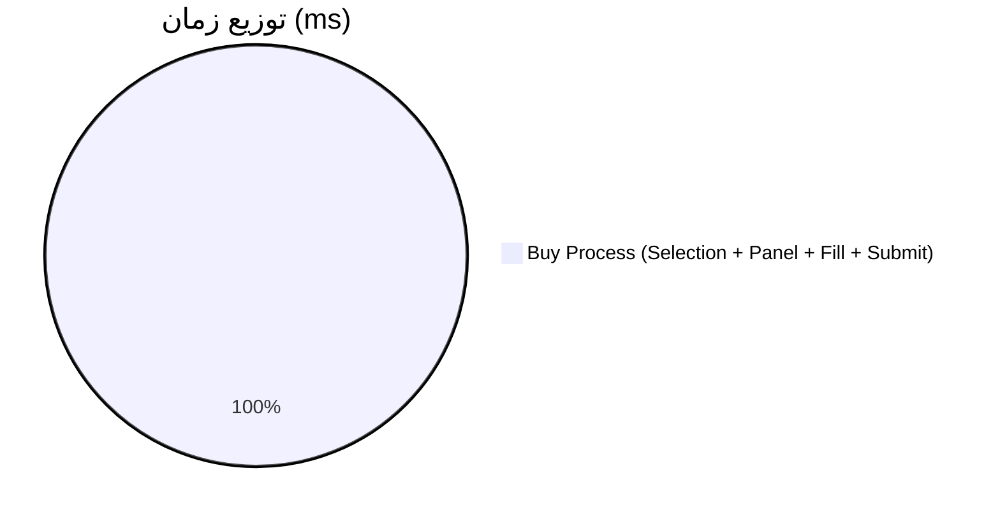

# گزارش تحلیل معامله - buy-1767789874368

**تاریخ:** ۱۴۰۴/۱۰/۱۷, ۱۶:۱۴:۳۴
**Order ID:** buy-1767789874368

## 📋 خلاصه اجرایی

| فیلد | مقدار |
|------|-------|
| Order ID | buy-1767789874368 |
| Model | 5 |
| نماد | زر |
| نوع | خرید |
| قیمت | 681000 |
| تعداد | 2 |
| زمان کل | 1323ms |
| وضعیت | ✅ موفق |

### مقایسه با Benchmarks

| Model | Benchmark | زمان فعلی | تفاوت |
|-------|-----------|-----------|-------|
| Model 4 | 200ms | 1323ms | +1123ms |
| Model 5 | 364ms | 1323ms | +959ms |
| Model 6 | 50ms | 1323ms | +1273ms |

### 🔍 یافته‌های کلیدی

- 1 bottleneck اصلی شناسایی شد: Buy Process (Selection + Panel + Fill + Submit)

## ⏱️ Breakdown Timing

| Phase | زمان (ms) | درصد |
|-------|-----------|------|
| Browser Launch + Page Navigation (Pre-transaction) | 0 | 0.0% |
| Balance Reading (Before) | 0 | 0.0% |
| Buy Process (Selection + Panel + Fill + Submit) | 1326 | 100.2% |
| Post-processing (Overhead) | 0 | 0.0% |
| **Unaccounted Time** | -3 | -0.2% |
| **Total** | 1323 | 100% |

### نمودار توزیع زمان

### Timeline

```mermaid
gantt
  title Timeline معامله
  dateFormat X
  axisFormat %L ms
  Browser_Launch_+_Page_Navigation_(Pre-transaction) : -24114, 0
  Balance_Reading_(Before) : -3580, 0
  Buy_Process_(Selection_+_Panel_+_Fill_+_Submit) : -1326, 1326
  Post-processing_(Overhead) : 2012, 0
```

## ⚠️ Bottlenecks شناسایی شده

### 1. Buy Process (Selection + Panel + Fill + Submit)

- **شدت:** 🔴 بالا
- **زمان:** 1326ms (100.2%)
- **توصیه:** Migration به Model 5 یا 6
- **بهبود مورد انتظار:** کاهش 95%+ با migration به API

## 💡 پیشنهادات بهینه‌سازی

### 1. Migration به Model 5 (API Direct)

- **اولویت:** 🔴 بالا
- **نوع:** Migration Model
- **توضیحات:** Buy Process با Model 4 کند است. استفاده از Model 5 (API) می‌تواند زمان را به 50-100ms کاهش دهد.
- **بهبود مورد انتظار:** 1260ms (95%)
- **پیاده‌سازی:** استفاده از Model 5 در dashboard: `model: "5"`
- **تأثیر:** صرفه‌جویی 1260ms (95%)

### 2. Migration به Model 6 (Ultra Fast)

- **اولویت:** 🟡 متوسط
- **نوع:** Migration Model
- **توضیحات:** Model 6 برای سرعت حداکثری طراحی شده است (target: <50ms)
- **بهبود مورد انتظار:** 1273ms (96%)
- **پیاده‌سازی:** استفاده از Model 6 در dashboard: `model: "6"`
- **تأثیر:** صرفه‌جویی 1273ms (96%)

## 🔄 مقایسه با Model 5/6

### Model 5 (API Direct)

| فیلد | مقدار |
|------|-------|
| زمان تخمینی | 50ms |
| بهبود | 1273ms (96%) |
| پیچیدگی Migration | 🟢 پایین |

**مزایا:**
- ✅ API-based (بدون UI automation)
- ✅ سرعت بالا (50-100ms پس از بهینه‌سازی)
- ✅ قابلیت skip verification
- ✅ Token caching برای سرعت بیشتر

**معایب:**
- ❌ نیاز به token extraction
- ❌ وابستگی به API stability

### Model 6 (Ultra Fast)

| فیلد | مقدار |
|------|-------|
| زمان تخمینی | 50ms |
| بهبود | 1273ms (96%) |
| پیچیدگی Migration | 🟡 متوسط |

**مزایا:**
- ✅ سریع‌ترین model (<50ms)
- ✅ بدون verification
- ✅ بدون retry overhead
- ✅ بهینه شده برای سرعت حداکثری

**معایب:**
- ❌ بدون retry (در صورت خطا)
- ❌ بدون verification (نیاز به اطمینان از موفقیت)

